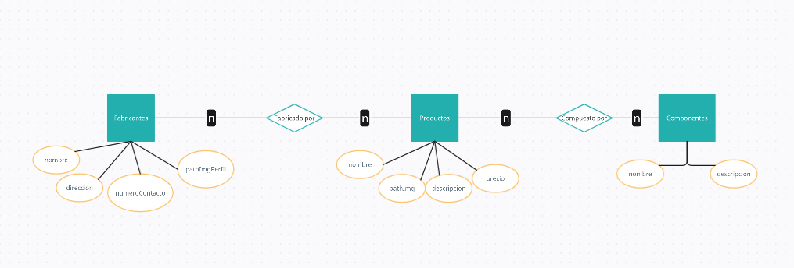

# Trabajo practico Estrategias de persistencia

# Pasos para inciar la api
- Instalar dependencias
- Configurar variables de entorno en el archivo .env con los datos de la base de datos que se quiera usar. Si no se especifica, se usara por default una base de datos sqlite
- En caso de ser la primera vez que se usa la api se puede optar por crear las tablas con o sin datos pre cargados        
- Levantar api

# Instalar dependencias
    ```bash
      npm install

# Crear tablas con/sin datos
    - Creacion de tablas con datos precargados
    ```bash
      npm run init-db

    - Creacion de tablas sin datos
    ```bash
      npm run sync-db


# Iniciar API

    ```bash
    npm run dev

# Observaciones
    Decidimos que en las rutas los id se llamen productoId, fabricanteId, componenteId, ya que habia conflictos con los middleware en caso de querer validar 2 ids de una misma ruta

